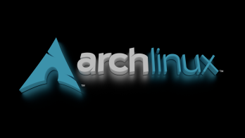

Když si nebudeš jistý jaký použít Tag podívej se na náš hint https://git.archoslinux.cz/kankys/html_hint
Základy html, toto je začátečnický tutorial na první statický web.
* Později až si vytvoříme vlastní web tak si ho nahrajeme na internet a naučíme se dělat k vaší stránce pod stránky. Zatím budeme pracovat u sebe v počítači.
* Pokud si dovašeho projektu chcete udělat poznámku zapíšete ji do ``` <!-- text --> ```
 Vaši první stránku si uložíte jako index.htlm.
* Já používám na tvorbu webu IDE Brackets https://brackets.io/
* Doporučuji si nainstalovat plugin HTLM SKELETON co vám sám vypíše strukturu vaši stránky.
* Svůj projekt si pravidelně ukládejte pomocí CTRL-S.
* Váš první projekt vždy začínejte tím že si vytvoříte soubor index.htlm . Nebo v programu v kterém budete tvořit web,
  dáte založit, vytvořit nový projekt (všude se to může jmenovat trochu jinak). Než začnete psát svůj web, tak tento projet než budete
  mít jedinou řádku kódu uložíte jako index.htm. Pak už můžete začít psát. Tímto postupem řeknete vašemu IDE (programu napsaní webu)
  že se jedná o webovou stránku. A on se přizpůsobí tomuto projektu.
* htlm je tzv. značkovací jazyk a skládá se ze značek, tzv. tagů. 
* Tagy začínají ```<něco>(podle toho co chcete zapsat) mezi tagy je text </neco> (a zde je konec tagu)"```. Vše zapisujeme do tagu.
* Tag zapíšeme pravý alt+? a al+:. * je pravý alt+--- klávesa hned vedle otazníku.
* Atributy jsou obsah v tagách, například: ```lang="cs-cz"```, hodnotu atributu můžeme zapsat do "".
* K náhledu vaší práce můžete v Brackets použít vpravo nahoře ikonu blesku.

* Náš nový projekt začne hlavičkou 

```
<!DOCTYPE html>
<html lang="cs-cz">  tímto nastavíme lokalizaci, na slovensku budou mít např: sk 
<head>
    <meta charset="utf-8">  utf-8 je kódování a informace pro prohlížeče, utf-8 musí podporovat vaše
                           IDE v čem děláte web 
    <meta name="viewport" content="width=device-width, initial-scale=1.0">
    <title>Kankys Project</title>  zde napíšeme název vašeho projektu, pak ho uvidíte nahoře v záložce jak otevřete projekt v prohlížeči 
</head>
```

 Zde je samotné tělo stránky, to co vídíme na webu je ohraničeno v body.
```
<body> 
<h1>Zde začíná tvůj Projekt!</h1>
```
<h3>Tagy</h3> 
 
    
 Odstavce vytvoříme pomocí p.
 Pro lepší přehlednost kódu, po každém tagu začínáme novím řádkem.
 ```
<p> Zde je první odstavec </p> 
```
 br slouží odřádkování, za br uděláme mezeru.
 ```
<p> Druhý odstavec. Zde navíc máme odřádkování pomocí br. <br /> 
```
```
<p> A třetí odstavec. A věta v něm. </p>
```


 Tagy, zde si vypíšeme základní tagy pro úpravu textu. 
U tagu musíme dodržovat jejich pořadí při ukončení, když jich chcete použít více.
Pozor některé tagy mohou způsobit chybu při jejich kombinaci, méně je někdy více.
Pokud si chcete zvýšit SEO tak používejte STRONG, když je potřeba zdůraznit název, jméno,
důležitou informaci. Prohlížeče upřednostňují strong, ale používejte ho z rozmyslem. 
 Pokud potřebujeme něco označit tučně, použijeme v tag strong. 
 ```
<p> Pomocí tagu <strong>STRONG</strong> mohu psát tučně </p>
```
 Výrazem em zapíšeme kurzívu.
 ```
<p> Pomocí tagu "em" <em>budeme psát kurzívou</em></p>
```
Text si podtrhneme pomocí u.
```
<p> Svůj text si můžete <u>podtrhnout</u> pomocí tagu u </p>
```
Text si můžete i přeškrtnout díky tagu s.
```
<p> Mám rád <s>tučné</s> zdravé jídlo. </p>
```
K zvýraznění slouží tag mark, automaticky zvýrazňuje žlutě.
```
<p> Pokud sděluji něco důležitého tak to <mark>žlutě zvýrazním.</mark></p>
<p><strong><u><em> Kombinace tagu </em></u></strong></p> 
```
    
 Další důležitou věcí co je potřeba umět v základech jsou nadpisy.
Nadpisy máme šesti typů dle velikosti.
Zapisují se do tagu a to jako h1 až h6.
Vždy musí být v tagu, začínat i končit stejným h, nejde kombinovat h2 a h3. 
```
<h1>Nadpisy v HTLM h1</h1>
<h2>Nadpisy v HTLM h2</h2> 
<h3>Nadpisy v HTLM h3</h3>    
<h4>Nadpisy v HTLM h4</h4>    
<h5>Nadpisy v HTLM h5</h5>
<h6>Nadpisy v HTLM h6</h6>
```

 Tak základní jednoduchou stránku umíme, ale co by byl web bez obrázku.
Důležitá věc, obrázky nebo složku z obrázky, které budete chtít dát na web, vložte do stejné složky kde máte index.html.
v budoucnu až by jsme nahrávali vaši stránku na web tak by se obrázky nezobrazili. Nebo i pokud by jste pracovali na více počítačích
a přenášely pouze složku z index.html také by vám to nešlo.

<h3>Obrázky</h3> 


 Obrázky vkládáme pouze do jednoho tagu takzvaně nepárovaného.
Obrázek vložíme do tagu img a použijeme atributy:
src: cesta k obrázku
alt: popis obrázku, ten je velmi důležitý hlavně pro lidi, kteří jsou znevýhodněni zrakovou vadou (k tomuto tématu se dostaneme později, jak 
co nejlépe nastavit web pro tyto lidi a bude tomu věnovaný samostatný tutoriál) a nebo jen lidi kteří používají třeba čtečku textu v mhd. 

 Do složky, kde máme web vytvoříme složku obrázky a do ní vložíme obrázek co chceme vložit do své stránky.
Pak už jen nastavíme cestu k obrázku a popis obrázku.
Obrázky vkládejte JPEG, PNG nebo WepP u jiných formátu nedokážu zaručit korektní zobrazení.
Cestu k obrázku nezadávejte celou kde ji máte na disku, pouze zadejte cestu obrázky/a obrázek.
Vaše stránka kouká pouze do složky kde máte index.html
Také nedoporučuji vkládat obrázky jako odkaz někam na internet. Může se stát že by je někdo smazal. 
```
<p>
    
</p>  
``` 

 U obrázku můžeme měnit rozměry pomocí atributů width a height.
Hodnoty se zadají buď jako pixeli "10" nebo procenta "10%"
Pokud zadáte jen jeden atribut druhý se automaticky dopočítá.
Pozor obrázek se nezmenšuje, ale pouze zobrazuje menší či jinak rozměrově upravený!!!
Pokud obrázek chcete zmenšit protože je veliký, musíte použít na to specializovaný program. 
```
<h4>Obrázek Arch Linux zmenšený</h4>    
    
    
<p>
    
</p> 
```
    
<h3>Odkazy</h3>

Pokud chcete do webu vložit odkaz použijete tag a a za něj vložíte atribut href a navíc si odkaz v šipkách pojmenujete.

```
 <a href="http://www.lukan.cz">odkaz na Lukáš Bloguje</a>

``` 

<h3>Elementy</h3>

Element vám vloží například za nadpis Odkaz na článek. Odkaz vložíme mezi tagy h1 - h6.

``` 
 <h3>Lukan <a href="https://lukan.cz">Lukáš Bloguje</a></h3>
``` 

<h2>První podstránka</h2>


Už se blížíme ke konci první části našeho seriálu. Na konec prvních kroků z html si vyrobíme pod stránku. Začneme stejně jako, když jsme zakládaly index.html.

My si vytvoříme stránku O mě.

Vytvoříme prázdný dokument o-me-html.

Do ní vložíme pomocí pluginu skeleton kostru stránky. A nastavíme ji podle mě.

``` 
<!DOCTYPE html>
<html lang="cs-cz">
<head>
  <meta charset="utf-8">
  <title>O mě</title>
</head>
``` 

Při zadávání textu nezapomeňte používat tagy -p- a -br-.

``` 
<body>
    <h1>O mě</h1>
    <p>
    Jsem IT nadšenec s pozitivním přístupem k životu a vášní pro technologie, ve kterých se neustále vzdělávám. Absolvoval jsem kurz testingu a SQL v Acamaru.
    </p>
    
    <p>
Ve volném čase se věnuji:<br>
Svému blogu <a href="https://lukan.cz"></a>.<br>
Linuxu, MacOS a Opensource.<br>
Jsem členem spolku Arch Linux CZ, kde se podílím na správě webu <a href="https://arch-linux.cz"></a> a dalších webových aplikacích (NextCloud, Bitwarden, Mastodon atd.).<br>
Správě webových stránek pro neziskovou canisterapeutku – <a href="https://terapiesepsem.cz"></a>.<br>
Seberozvoji v oblasti komunikace a emoční inteligence.<br>
Sportu, který mi dobíjí baterky.<br>
    </p>
 ```    

Na závěr si uděláme pro klik na hlavní stranu. Na hlavní straně také uděláme pro klik na stránku o mě stejným způsobem.

``` 
<p><a href="index.html">Zpět na hlavní stranu</a></p>    
  
</body>
</html>
``` 

Doufám že vám tento tutoriál pomohl budu velmi rád, když mi napíšete.

A do budoucna určitě zde budu přidávat další obsah okolo html.

    
    

    


Běží na Gitea Verze: 1.17.3 Strana: 52ms Šablona : 7ms Licence API Webové stránky